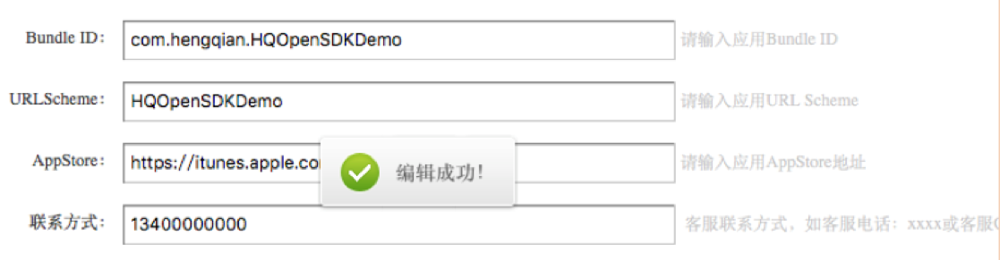
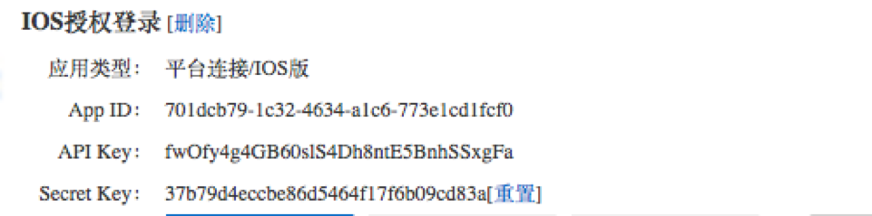
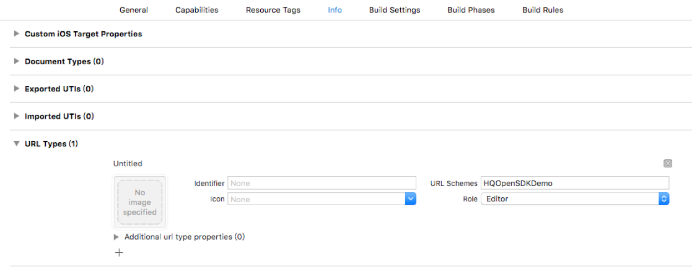
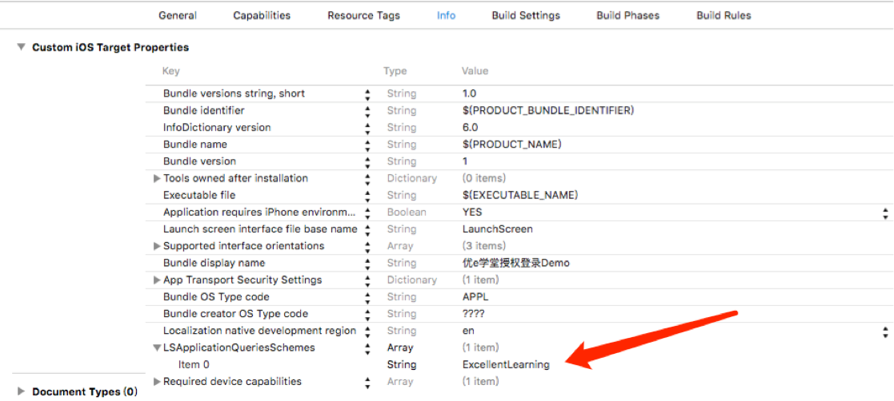

​								 

# 

# 平台概述

- 认证授权

  优e学堂IOS SDK为开发者提供了第三方登录授权认证功能，使第三方应用无需了解复杂的验证机制即可进行授权登录操作。

  本文档介绍了优e学堂 IOSSDK的授权方式，并给出简单的示例分析，帮助第三方开发者快速集成应用。

- 名词解释

  |     名词     |                    注释                    |
  | :--------: | :--------------------------------------: |
  |  App Key   |     分配给每个第三方应用的AppKey,用于鉴权身份，显示来源等功能     |
  | URL Scheme |              用来定位应用，实现应用间跳转              |
  |   token    |           授权登录成功后，返给第三方应用的用户令牌           |
  |   secret   |           授权登录成功后，返给第三方应用的用户秘钥           |
  |   账号直接授权   | 通过唤起优e学堂，获取优e学堂当前账号信息进行授权，并返回token和secret |
  |  手动输入账号授权  |        通过输入优e学堂账号授权，并使用输入账号登录优e学堂        |

  ​

# SDK集成说明

## 1.SDK集成

在集成使用优e学堂第三方登录功能时，请按照如下步骤完成操作内容。

### 1.1集成准备

- 使用优e学堂第三方登录功能时，需要有对应的优e学堂开发者账号，如果没有请按照如下步骤完成账号的准备工作：

  1).  登录 [http://open.hengqian.net/ ](http://open.hengqian.net/%20) 网站，进入恒谦教育云平台主页，点击右上角注册成为开发者，可以注册自己的优e学堂开发者账号；

  2).添加自己的应用，同时记录分配给该应用的客户端密钥值；后面授权登录sdk需使用该密钥。

  

  - 1、Bundle ID:

    应用的唯一标示

  - 2、URLScheme

  ​       用来定位应用，实现优e学堂到应用的跳转

  - 3、AppStore

    应用在AppStore的下载地址

  - 4、联系方式

    电话或QQ

  3).应用添加到恒谦教育云平台后，可获取到云平台发放的API Key和Secret
  Key，如下图：

  

## 1.2导入SDK开发包

- 请依照如下步骤导入相关SDK内容到您的开发项目中：
  - 解压缩 YouXue_IOS_SDK.zip 集成压缩包；
  - 将HQOpenSDK.framework文件夹导入工程中。

## 1.3设置URLScheme

- 设置自己应用的URL Schemes

  

- 将优e学堂的URL Scheme加入白名单

  


## 2.SDK使用说明(详情见HQOpenSDKDemo)

### 2.1 配置APPKEY和URLScheme

- 在`AppDelegate`的`-(BOOL)application:(UIApplication*)application didFinishLaunchingWithOptions:(NSDictionary *)launchOptions`方法中添加如下代码：

  ```OBJC
  - (BOOL)application:(UIApplication *)application didFinishLaunchingWithOptions:(NSDictionary *)launchOptions {
      // Override point for customization after application launch.
      
      ............
      
      //初始化HQAuthorizationManage单例
      HQAuthorizationManage *manage = [HQAuthorizationManage shareHQAuthorization];
      //接入恒谦云平台时，获取的API Key
      manage.apiKey = @"fwOfy4g4GB60slS4Dh8ntE5BnhSSxgFa";
      //当前应用的urlScheme  注意：需将优e学堂的urlScheme = ExcellentLearning 加入白名单
      manage.urlScheme = @"HQOpenSDKDemo";
      
      return YES;
  }
  ```


### 2.2授权登录

- 授权登录接口：

  ```OBJC
  /**
  *  开始授权登录方式检测
  *
  *  @param urlScheme 你app的URL Scheme
  *  err 授权检测错误原因
  */
  -(void)authorizeLoginBegin:(NSError * __autoreleasing*)err;
  ```

  ​

### 2.3处理授权后返回的信息

- 在优e学堂授权登录成功返回后或从优e学堂跳转至第三方时，传递的url携带的参数都为加密数据，需在 AppDelegate的`- (BOOL)application:(UIApplication *)app openURL:(NSURL *)url options:(NSDictionary<NSString *,id> *)options`方法中调用sdk中的处理url方法:

  ```OBJC
  /**
  *  处理优e学堂传递的url加密数据
  *  @param url 优e学堂跳转回来的url
  */
  -(void)handleApplicationUrlWithExcellentLearning:(NSURL *)url;
  ```

  ​

- 通过实现SDK代理接收解析后的accessToken和accessSecret:

  ```OBJC
      /**
  *  解析后的accessToken和accessSecre
  *  @param accessToken
  *  @param accessSecret
  */
  -(void)handleApplicationUrlWithExcellentLearning:(NSURL *)url;
  ```

  ​

### 2.4 清理SDK缓存数据

- 退出账号时，需调用sdk的清理数据方法：

  ```OBJC
  /**
  *  退出账号时，清理sdk相关信息
  */
  -(void)resetExcellentLearningSDKCacheProfile;
  ```

  ​

### 2.5开发接口调用

- 调用恒谦云平台开发接口API时，需先通过sdk获取签名或get请求的完整url：

  ```OBJC
  /**
  *  获取签名sign 或 get请求完整的url地址
  *  @param urlStr 请求的url
  *  @param parmaDid 请求用到的参数 （参数除sign外都需要传，可以传空）
  *  @param secretKey 若该接口请求参数中有token，secretKey为授权登录返回的secret
                      否则secretKey为在恒谦云平台创建应用时，获取的Secret Key
  *  @param completeUrl YES:返回get请求完整的url NO:返回签名sign
  */
  -(NSString *)getHQAuthSignWithURL:(NSString *)urlStr
    					    withParma:(NSDictionary *)parmaDic 
                      withSecretKey:(NSString *)secretKey  
                        completeUrl:(BOOL)completeUrl;
  ```

  ​

### 2.6 SDK中其它方法说明

- `-(void)hq_authorizeLoginToLaunchExcellentLearing;`该方法为调用`\- (void)authorizeLoginBegin:(NSError * __autoreleasing*)err;`进行授权登录时，应用跳转到优e学堂时响应该代理方法。

  ```OBJC
  /**
  *  授权登录检测成功后，将要跳转到优e学堂
  */
  -(void)hq_authorizeLoginToLaunchExcellentLearing;
  ```

  ​

- `-(void)hq_isChangeAccountLogin:(BOOL)isChange;`该方法为从优e学堂中点击应用，跳转到应用中，

  sdk中判断应用当前账号与优e学堂当前账号不同时，弹窗提示用户是否切换优e学堂账号登录，用户点击弹窗选择按钮后，会响应该代理方法：选择确定：isChange为YES，选择取消：isChange为NO。

  ```OBJC
      /**
  *  从优e学堂跳转应用，优e学堂账号与应用账号不一致时
  *  isChange : 是否选择切换账号   YES:是  NO:否
  */
  -(void)hq_isChangeAccountLogin:(BOOL)isChange;
  ```

  ​


- `-(void)hq_accountIsSameToAppAccount;` 该方法为从优e学堂中点击应用，跳转到应用中，sdk中判断应用当前账号与优e学堂当前账号相同时，响应该代理。

  ```OBJC
  /**
  *  从优e学堂跳转应用，并且优e学堂的登录账号与当前应用账号相同
  */
  -(void)hq_accountIsSameToAppAccount;
  ```


# 常见问题

- 1.点击优e学堂登录没反应

  - 查看是否配置了HQAuthorizationManage的apiKey和urlScheme

- 2.优e学堂登录没有获取到授权信息？

  - 查看是否配置了正确的apikey
  - 查看网络是否正常

- 3.点击优e学堂登录，进入优e学堂下载界面？

  - 手机安装的优e学堂为低版本 
  - 检查是否将优e学堂的URLScheme(ExcellentLearning)加入白名单

- 4.在优e学堂中点击应用，程序崩溃或没有反应？

  - 查看是否安装了当前点击的应用(未安装有提示)
  - 查看BS端申请时填写的信息是否正确
  - 查看异常输出提示

- 5.进入优e学堂授权登录后，无法返回应用

  - 检查HQAuthorizationManage的urlScheme是否配置正确

- 6.请求恒谦教育云平台开发接口api时，提示签名错误。

  - 检查参数secret Key是否传正确。 
  - ​检查参数字典是否传正确。