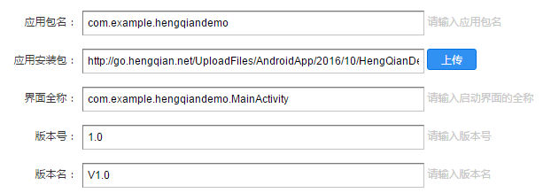

​					
# 

## 平台概述

- 认证授权

  优e学堂Android SDK为开发者提供了第三方登录授权认证功能，使第三方应用无需了解复杂的验证机制即可进行授权登录操作。
  本文档介绍了优e学堂Android SDK的授权方式，并给出简单的示例分析，帮助第三方开发者快速集成应用。

- 名词解释

  |     名词     |                    注释                    |
  | :--------: | :--------------------------------------: |
  |  App Key   |     分配给每个第三方应用的AppKey,用于鉴权身份，显示来源等功能     |
  | IUiListener |              第三方应用授权回调监听              |
  |   token    |           授权登录成功后，返给第三方应用的用户令牌           |
  |   secret   |           授权登录成功后，返给第三方应用的用户秘钥           |
  |   账号直接授权   | 通过唤起优e学堂，获取优e学堂当前账号信息进行授权，并返回token和secret |
  |  手动输入账号授权  |        通过输入优e学堂账号授权，并使用输入账号登录优e学堂        |

  ​

# SDK Android Studio集成说明

## 1.SDK集成

在集成使用优e学堂第三方登录功能时，请按照如下步骤完成操作内容。

### 1.1集成准备

- 使用优e学堂第三方登录功能时，需要有对应的优e学堂开发者账号，如果没有请按照如下步骤完成账号的准备工作：

####   1.  登录 [http://open.hengqian.net/ ](http://open.hengqian.net/%20) 网站，进入恒谦教育云平台主页，点击右上角注册成为开发者，注册优e学堂开发者账号；

####   2.添加自己的应用，同时记录分配给该应用的客户端密钥值(APIKEY)；后面授权登录sdk需使用该密钥。
  	注：开发者平台中的APIKEY就是移动应用使用的appkey
  
#####   申请appkey说明：

#####     1)、应用包名
       		安装包APK的包名。如：com.hq.otherdemo
#####     2)、应用安装包
       		上传的安装包需要审核
#####     3)、界面全称
       		带包名全路径的启动界面全称，如：com.hq.otherdemo.OtherActivity
#####     4)、版本号
       		除第一次上传版本号，其他输入版本号必须比之前上传的版本号高
#####     5)、版本名
       		当前版本的名称
####   3.应用添加到恒谦教育云平台后，可获取到云平台发放的API Key和Secret Key，如下图：

## 1.2导入SDK开发包
	请依照如下步骤导入相关SDK内容到您的开发项目中：
	注意：目前整个工程全采用中文注释，为了防止乱码滋生，请修改文本编码方式为UTF-8
### 1）方式一
    引用opensdklibrary工程
    在你自己的工程中，添加YouXueSDKDemo工程的引用
    build.gradle中配置：compile project(':opensdklibrary')
### 2）方式二
    复制opensdklibrary.aar文件到您的开发项目的 libs/ 目录下面；
    build.gradle中配置：compile(name:'opensdklibrary', ext:'aar')

## 1.3配置

    权限配置
    <uses-permission android:name="android.permission.SYSTEM_ALERT_WINDOW"/>
    <uses-permission android:name="android.permission.ACCESS_NETWORK_STATE"/>
    <uses-permission android:name="android.permission.INTERNET" />
    <uses-permission android:name="android.permission.WRITE_EXTERNAL_STORAGE" />
    
    配置APPKEY
    <meta-data
        android:name="HQ_OPEN_KEY"
        android:value="BS端申请的API KEY">
    </meta-data>
    注册Application
    <application
            android:name="包名.MyApplication"（自定义Application的名字）
    </application>
    
    配置build.gradle，添加如下配置
      dependencies {
          compile 'com.github.zhaokaiqiang.klog:library:1.5.0'
          compile 'com.squareup.okhttp:okhttp:2.7.4'
          compile 'com.squareup.okio:okio:1.6.0'
          
      }
    配置代码混淆,添加如下配置
    -dontwarn okio.**
      -keep class okio.**{*;}
      -dontwarn com.squareup.**
      -keep class com.squareup.**{*; }
      -dontwarn com.socks.**
      -keep class com.socks.**{*; }
      -dontwarn com.hqjy.**
      -keep class com.hqjy.**{*;} 

## 1.4初始化SDK
    自定义Application
    在onCreate中，初始化SDK，方法如下：
    //初始化SDK
    HengQianSDK.getInstance().initSDK(this);

## 1.5设置登录授权
    在登录授权界面通过调用HQAuth类的login()方法发起登录：
    @Override
    protected void onCreate(Bundle savedInstanceState) {
       super.onCreate(savedInstanceState);
       setContentView(R.layout.activity_main);
       mHQAuth = HengQianSDK.getInstance().createAuth(this);
    }
    mHQAuth.login();   

## 1.6处理授权返回值
    @Override
      protected void onActivityResult(int requestCode, int resultCode, Intent data) {
            super.onActivityResult(requestCode, resultCode, data);
                mHQAuth.onActivityResultData(requestCode, resultCode, data, new IUiListener() {
                @Override
                public void onComplete(String result) { 
        //授权成功信息返回值处理  
        }
                @Override
                public void onError(String errorCode) { 
        //授权失败信息返回处理	
        }
      });
      }

## 1.7数据清理：
    在退出登录界面调用logout()方法
      @Override
      protected void onDestroy() {
        super.onDestroy();
        mHQAuth.logout();
      }

## 1.8开发接口调用：
  -设置测试人员
    在开放平台应用中，添加授权的测试人员。
  -授权登录成功后调用开放接口获取数据，举例如下两种方法：
###  1）获取开放接口数据可以使用以下方法，也可自行编写方法
    	注意：开放接口中需要token参数的，使用移动端授权登录返回的token，参数sign使用移动端授权登录返回的appkey
		Map<String, String> params = new HashMap<String, String>();
		String URL = "http://api.hengqian.net/openApi/users/me.json";
		String APIKey = "FVui6P7SV*********4TAU5Ypktgu1g9ud";
		params.put("consumerKey", APIKey);
		params.put("token", mToken);
		params.put("timeTamp", Long.toString(System.currentTimeMillis() / 1000));
		params.put("field", "district");
		String requesURL = HengQianSDK.getInstance().joinRequestUrl(URL, params, mSecret);
		OkHttpUtil.getInstance().execute(RequestBuilder.create()
			.setRequestMethod(RequestBuilder.Method.GET)
			.setUrl(requesURL).setHttpCallback(new HttpCallback() {
			@Override
			public void onFinish(final HttpResult result) {
				MainActivity.this.runOnUiThread(new Runnable() {
					public void run() {
						Log.e("info", "info = " + result.getResult());
					}
				});
			}
		}));
###  2）开放接口中不需要token参数的，参数sign使用开放平台应用信息中的Secret Key
      	Map<String, String> secondparams = new HashMap<String, String>();
		String secondURL = "http://api.hengqian.net/openApi/users/show.json";
		String secondAPIKey = "FVui6P7SV**********8U5Ypktgu1g9ud";
		mSecret = "3e185f399b0***********81b7a423d10b2";
		secondparams.put("consumerKey", secondAPIKey);
		secondparams.put("uids", "47f426e***************83c83b841");
		secondparams.put("timeTamp", Long.toString(System.currentTimeMillis() / 1000));
		secondparams.put("field", "district");
		String secondrequesURL = HengQianSDK.getInstance().joinRequestUrl(secondURL, secondparams,mSecret);
		OkHttpUtil.getInstance().execute(RequestBuilder.create()
			.setRequestMethod(RequestBuilder.Method.GET)
			.setUrl(secondrequesURL).setHttpCallback(new HttpCallback() {
			@Override
			public void onFinish(final HttpResult result) {
				MainActivity.this.runOnUiThread(new Runnable() {
					public void run() {
						Log.e("data = ", result.getResult());
					}
				});
			}
		}));
# 常见问题

#####1.SDK初始化不成功？
	a.查看是否自定义了application，并在其中调用了HengQianSDK.initSDK()方法
	b.查看是否在清单文件中配置了正确的appkey
	c.查看是否在清单文件中注册了自定义的application
#####2.优e学堂登录没有获取到授权信息？
	a.查看是否在清单文件中配置了正确的appkey
	b.查看网络是否正常
#####3.点击优e学堂登录，进入优e学堂下载界面？
	a.查看是否安装了优e学堂正式版本
#####4.点击优e学堂登录，没有反应？
	a.查看是否安装了优e学堂最新版本，低版本不兼容第三方登录
	b.查看是否在清单文件中配置了正确的appkey
#####5.点击优e学堂登录，进入优e学堂手动输入授权界面？
	a.查看优e学堂是否登录
#####6.手机安装了优e学堂，点击优e学堂登录，弹出未安装对话框或者提示“当前优e学堂版本太低”？
	a.手机安装的优e学堂不是官方版本，或者为低版本。更新升级优e学堂最新版本。
#####7.集成优e学堂SDK后，点击“优e学堂登录”，提示“API Key不正确，请配制正确的API Key！”
	a.查看应用包名和在BS端申请时填写的包名是否相同，不同请更改。
